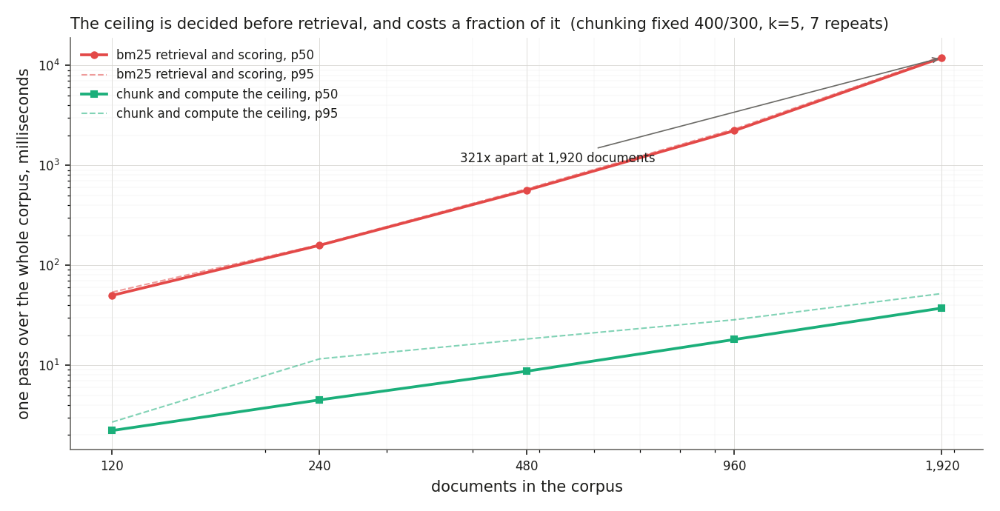

# chunk-recall-audit

**An audit that tells you, before you run any retriever, the highest score any retriever could ever reach on your chunking, and then attributes every failure to the chunker or the retriever so an embedding upgrade is a decision rather than a hope.**

[](https://github.com/srujan20/chunk-recall-audit/actions/workflows/ci.yml)
[](#tests-coverage-and-receipts)
[](#tests-coverage-and-receipts)
[](#every-number-here-is-checked-by-ci)
[](#the-three-verdicts-on-real-runs)
[](LICENSE)

## What this solves

- **Your retrieval dashboard says 1.0 and your pipeline answers a quarter of the questions.** Recall at k asks whether any retrieved chunk *touches* the answer, so a chunk holding the last three words counts. On the worst chunking in this plan the standard metric **reports a recall of 1.0**, the pipeline **actually answers 0.2528**, and **269 of them cannot answer** on their own. That is **a gap of 0.7472** between the number on the dashboard and the number a user experiences.
- **The embedding upgrade you are about to buy provably cannot help.** Across **13 chunkings** at k equal to 5 there were **1663 failures**, of which **1661 were the chunker's** and **2 were the retriever's**. **10 of the thirteen** configurations have no retriever fixable failure at all. No retrieval metric in use today would tell you that, because the two causes look identical to any function of the retrieved chunks.
- **The bound costs nothing to compute, so there is no excuse for not knowing it.** Whether a chunk holds an answer whole is a question about character offsets, with an exact answer and no model involved. At the largest corpus measured here the **ceiling takes 2.2 ms** at the small end and **37.3 ms at the largest**, while retrieval on the same corpus **retrieval takes 11974.3 ms**. The number that bounds every retriever a team will ever try is available before it picks one.

## Executive summary

A retrieval evaluation reports a number that is not the number anybody cares about. Recall at k counts a question as answered if any retrieved chunk overlaps the labelled answer, and a chunker that cut the answer in half satisfies that test twice over. The quantity that matters is whether some single retrieved chunk held enough to answer on its own, and the difference between the two is not a rounding error: on 200 character **chunks the ceiling is 0.2917**, leaving **a gap of 0.7056** against the standard metric on the same rankings, which reports 1.0. Span complete recall is **0.475 at four hundred** characters and **0.7389 at eight hundred**. A team reading the standard metric sees a retrieval system working and a team reading this one sees a chunker that destroyed most of its own corpus.

The structural point is that the ceiling is decided before retrieval and bounds everything after it. Aggregate the containment question over a labelled corpus and you get a **containment ceiling**: the highest span complete recall any retriever can reach on that chunking. It bounds BM25, it bounds a dense encoder, and it bounds a perfect oracle, because none of them can return a chunk that was never made. That is why the failure attribution is possible at all, and the attribution is where the money is: an embedding upgrade on a chunking with no retriever fixable failures is spend with a measured return of zero, and this audit is the only artifact in the pipeline that can say so in advance. What a team spends on embeddings is an assumption this repository cannot make for you; every number in this paragraph is measured and re-measured in CI.

The gap also does not close by retrieving more, which is the other thing teams try. On the worst chunking it is **0.85 at k equal to one** and **still 0.7472 at twenty**, because span complete recall goes **flat from k equal to 3** while the standard metric climbs to one. Retrieving more copies of a broken answer does not assemble one. **233 tests**, **99.2 percent line coverage**, over **260 audited combinations**, and `make verify` re-measures every figure quoted in this document, in the defense guide, in the policy file and in five decision records, and fails if any of them has moved.

## Watch it work (30 seconds)


Every line of terminal text above is real captured stdout from a command that ran, with each segment paced by that command's measured wall time. It is a replay of a captured session rather than a live screen recording, and [`docs/video/manifest.json`](docs/video/manifest.json) lists each command with its exit code and measured duration. Higher quality MP4: [`docs/video/demo.mp4`](docs/video/demo.mp4).

## The three verdicts on real runs

**A chunker that destroys material answers, blocked. Exit code 1.** A 200 character chunking, which is a default a lot of people ship. The report puts the ceiling above the measured recall on purpose, because the ceiling is the thing that decides what the measured recall could ever have been.


```
$ python -m chunkaudit audit --size 200 --stride 200
$ echo $?
1
```

**The finding in one picture.** The dark mark on each bar is the ceiling. The distance from the fill to the mark is what a better retriever could still win. Everything to the right of the mark is not available to anyone, and the standard metric's bar runs well past it.


**The attribution the standard metric cannot make.** Three causes, mutually exclusive, and two of them look identical to any function of the retrieved chunks.


| Cause | Fixable by a better retriever |
| --- | --- |
| No chunk anywhere holds the answer whole | no |
| A chunk holds it whole and was not retrieved | yes |
| The answer is not in the corpus | no |

**Causes that cannot be told apart. Exit code 2.** When the attribution is ambiguous within tolerance the tool says so and asks for a human, rather than picking the flattering reading. Exit 3 is a distinct code again, for an audit that could not run at all, because a tool that returns the same code for "the answers survived" and "I could not check" is a tool whose zero means nothing.


The guaranteed column is the longest answer each configuration preserves wherever it falls. [`docs/screenshots/manifest.json`](docs/screenshots/manifest.json) records which report each image came from and the measured contrast ratio of the verdict badge in it. The capture script fails the run if a badge is invisible or falls below a contrast ratio of 4.5, because the screenshot tool is the only thing in this pipeline that can see pixels.

## Architecture


<details>
<summary>the diagram source, and why this is a committed image</summary>

There is no mermaid fence here, and that is a decision rather than an omission. GitHub renders mermaid itself, and when it works the source is the picture, which is the better arrangement. It does not always work: a diagram that parses under mermaid versions ten and eleven locally can still come back from GitHub as "Unable to render rich display", which is a failure inside their renderer that nothing in this repository can fix. Three smaller traps pushed the same way. A diagram with HTML labels is not well formed XML, because the labels sit in a `foreignObject` with unclosed `br` tags, and it then displays when injected into a live page and fails silently as an `img src`, with `naturalWidth` 0 and nothing in any console. An `img src` with a percentage width and no intrinsic height leaves the browser without an aspect ratio. And a transparent background is not theme neutral, because light node fills with dark text come out as dark grey on near black in a dark theme.

So `tools/render_diagram.py` emits the SVG by hand, with `text` and `tspan` only, intrinsic dimensions, and one opaque rectangle covering the whole viewBox. It renders identically on GitHub, in an editor preview, in the PDF and offline. The layout it draws, which is the source in the sense that matters:

```diagram-source name=architecture
committed inputs
  documents, with every answer stored as a character span
  questions, each naming one document and one answer span
  policy file: strategy, size, stride, k, thresholds

decided by the chunker, before any retrieval exists
  chunk spans per document
  containment: does one chunk hold this answer whole
  containment ceiling = the share of questions where some chunk does
  guaranteed length = size minus stride plus one, for uniform windows

  no model, no similarity, no ranking. This is interval arithmetic

decided by the retriever, and bounded by the line above
  bm25, hashed character n grams, oracle, seeded shuffle
  top k chunks per question
  span complete recall  <=  the ceiling, always
  standard recall at k, which is not bounded by it and that is the finding

attribution, three mutually exclusive causes
  no chunk holds it whole    -> the chunker's, not fixable by retrieval
  a chunk holds it, not returned -> the retriever's, fixable
  the answer is not present  -> neither

verdict, one of three
  answers survive this chunking     exit 0
  the chunker destroys material answers  exit 1
  the causes cannot be told apart   exit 2
```

Regenerating the image after editing that layout is one command: `python tools/render_diagram.py`.

</details>

The dividing line is the chunking, and it is the whole design. Everything above it is decided by offsets and costs nothing to compute. Everything below it is a retrieval question, and it is bounded by the line above.

## What the measurement told me to throw away

This is the section I would most want reviewed, because in three of these four cases the tool contradicted something I had already written down.

**Rejected: comparing spans without checking they came from the same document.** The first version of the metric compared answer spans to chunk spans directly, which reads as obviously correct until you remember offsets are per document. A chunk covering characters 0 to 800 of one document numerically contains an answer at characters 100 to 500 of another. It reported a span complete recall of 0.850 against a ceiling of 0.828, which is impossible: the ceiling is an upper bound by construction, so a measured value above it is proof the measurement is wrong rather than news about chunking. Every comparison is now fenced by document id, and the invariant is a test. It is the most valuable test in the suite for a reason worth stating: it can only fail when a measurement is impossible, which is a stronger signal than any assertion about a value someone typed.

**Rejected: the whole document chunker, which wins on this metric.** A single chunk per document has a perfect ceiling and the smallest index in the plan, and by the numbers in claim one it dominates every other row. The reason nobody ships it is a price the ceiling cannot show, so the audit measures that too: it hands **7662 characters per question** to whatever consumes the results, while the best real alternative **reaches 0.8278 on 3731 characters**, less than half. What those extra characters cost downstream in generation quality, latency and token spend is outside this repository, and saying so is more useful than leaving a table in which one row dominates for reasons the table cannot show.

**Rejected: more overlap as a general improvement.** Window starts are multiples of the stride, so a smaller stride is not a superset of a larger one. With a stride of 800 the starts are 0 and 800; with 600 they are 0, 600 and 1200, and an answer needing a window that begins between 710 and 810 is kept by the first and destroyed by the second. There is **1 case in this plan** where it happened: going from fixed-200-200 to fixed-200-150 the ceiling **falls by 0.0389** while the index grows by **293 more chunks**. Overlap bought nothing and cost storage. There is also an exact counterexample constructed in the test suite, so the claim does not rest on this corpus.

| | costs | buys |
| --- | --- | --- |
| More overlap | chunks stored, linearly | a higher guarantee threshold, exactly |
| More overlap above that threshold | the same storage | a different set of surviving positions, not more of them |

**Kept: the ceiling, because the oracle proved it is tight rather than merely an upper bound.** An upper bound nobody attains is a weaker claim than it sounds. An oracle that ranks by overlap with the answer attains the ceiling on every chunking in the plan, with a **worst absolute difference of 0.0**. Had the oracle come in below it, the claim that no retriever reaches past the ceiling would have been true and useless.

## Method: what is decided before retrieval, and what after

A retrieval metric is a function of the retrieved chunks, so it cannot separate a chunk that never held the answer from a chunk that held it and was not returned. That is mechanical rather than arguable, so the table is mechanical too.

| Quantity | Decided by | Needs a retriever | Bounds what follows |
| --- | --- | --- | --- |
| Containment of one answer in one chunk | character offsets alone | no | yes, it is the atom the ceiling is built from |
| Containment ceiling | the chunking, over the whole corpus | no | yes, it bounds every retriever including an oracle |
| Guaranteed answer length | size and stride, in closed form | no | yes, below it survival is certain, above it is a lottery |
| Span complete recall | the chunking and the retriever together | yes | no, it is bounded by the ceiling |
| Standard recall at k | the chunking and the retriever together | yes | no, and it is not bounded by the ceiling, which is the finding |
| Failure attribution | all of the above | yes | no, it is the output |

### Your overlap is a guarantee threshold on answer length

For uniform character windows of size S advanced by stride T, an answer of length L sits inside some window wherever it falls if and only if L is at most S minus T plus one, which is the overlap plus one. That is arithmetic rather than a measurement, and this repository checks it by exhaustion rather than asserting it: at size four hundred and stride three hundred the guarantee is **101 characters at size four hundred**, every one of **all 3899 positions** survives at that length, and one character longer already fails somewhere.

| Answer length | 400-400 survival |
| --- | --- |
| 10 | 0.98 |
| 25 | 0.946 |
| 50 | 0.888 |
| 101 | 0.769 |
| 102 | 0.767 |
| 150 | 0.652 |
| 201 | 0.526 |
| 250 | 0.402 |

At 150 characters a chunking with no overlap keeps **0.652 of positions**, falling **down to 0.557 for a four hundred** character answer even at eight hundred character windows. Nobody sizing a chunker is told this, and it takes no model to compute. Reproduce with `python experiments/exp03_the_guarantee_threshold.py`.

### The chunker is the bigger lever, and by how much

Holding the corpus and the questions fixed, changing between the two real retrievers moves span complete recall by **at most 0.1972**. Changing the chunker moves it by **up to 0.7917**, which is **4 times as far**. The retriever is not irrelevant: the gap between BM25 and a seeded shuffle **reaches 0.9722, so the retriever** matters. It is the smaller lever, and it is the one every team reaches for first. Reproduce with `python experiments/exp05_which_lever_matters.py`.

### Every chunking in the plan, worst ceiling first

| Chunking | Chunks | Ceiling | Gap |
| --- | --- | --- | --- |
| fixed-200-150 | 1321 | 0.2528 | 0.7472 |
| fixed-200-200 | 1028 | 0.2917 | 0.7056 |
| fixed-400-400 | 547 | 0.475 | 0.525 |
| fixed-400-300 | 667 | 0.5917 | 0.4083 |
| sentence-1-1 | 2359 | 0.6667 | 0.225 |
| sentence-2-1 | 2239 | 0.6667 | 0.3333 |
| sentence-3-2 | 1148 | 0.6778 | 0.325 |
| fixed-400-200 | 908 | 0.6833 | 0.3167 |
| fixed-800-800 | 307 | 0.7389 | 0.2611 |
| recursive-400-300 | 610 | 0.7472 | 0.2528 |
| fixed-800-600 | 358 | 0.7667 | 0.2333 |
| recursive-800-600 | 336 | 0.8278 | 0.1722 |
| document | 120 | 1.0 | 0.0 |

Measured with BM25 at k equal to 5 over **360 questions** in **120 generated documents**. The ceiling column involved no retrieval at all. The **worst is fixed-200-150**. Reproduce with `python experiments/exp01_the_gap_the_standard_metric_hides.py`.

The attribution across the same plan: BM25 produced **1663 failures**, **1661 were the chunker's** and **2 were the retriever's**. The hashed vector retriever, which is materially weaker, **produced 177 retrieval failures** against the same 1661 from chunking, so even a much worse retriever does not change which cause dominates. Reproduce with `python experiments/exp02_who_can_fix_this.py`.

Every rate here carries its denominator. The corpus has 360 questions, so any rate measured on it has a resolution floor of one in 360, a measured zero supports **below 0.28 percent** and nothing stronger, and supporting one in a thousand would need a corpus about three times larger. The experiment prints that arithmetic rather than leaving a zero to be read as an absence.

## Tech stack

| Technology | Role in this project | Why chosen here |
| --- | --- | --- |
| Python 3.11, 3.12, 3.13 | the whole tool | it runs as a step in someone else's CI after one `pip install`, and the suite runs on all three because it asserts properties rather than values |
| numpy | score matrices, ranking, the hashed vectoriser | the whole sweep is matrix products, which is why 13 chunkings by four retrievers by five values of k finishes in **under 10 seconds** |
| PyYAML | the policy file | the thresholds are the subject of this repository, so they cannot live in code where a reader has to trust a diff to find them |
| Okapi BM25, implemented here | the default retriever | written from the published formula and asserted against arithmetic computed outside the implementation, because a repository whose claim is traceability should not have an opaque scorer at its core |
| A hashed character n gram vectoriser | the second real retriever | reproducible to the bit with no network and no model download, and it is called a lexical vectoriser rather than an encoder anywhere it appears |
| sentence-transformers, optional | a dense retriever, written and never run | the weights host is unreachable from this build environment, so the path exists, is tested with the module made unimportable, and prints itself as never run. ADR-003 states it and the CLI repeats it |
| pytest, pytest-cov | **233 tests**, **99.2 percent line coverage** | the ceiling invariant is a test, and it can only fail when a measurement is impossible |
| ruff | lint and format, on `src`, `tests`, `tools`, `experiments` and `benchmark` | one tool, one config, and no argument about style in review |
| GitHub Actions | three Pythons, then a separate pinned receipts job | the tests run against whatever resolves because they assert properties; the published rates are re-measured with exact pins |
| GitHub Actions composite action | distribution | `action.yml` makes this five lines in another repository, which is the difference between a demo and a tool |
| Playwright with Chromium | the report screenshots in `tools/` | the only way to check that a verdict badge is legible is to look at the pixels, and the capture asserts a contrast ratio before it saves |
| ffmpeg | the replay video | paced by measured wall time from a captured session, so the video cannot drift from the behaviour |
| matplotlib | the latency chart, in the evidence extra | drawn from `benchmark/results/audit_latency.json` and never by hand |
| cmark-gfm with Chromium | the defense guide PDF | one markdown source, two renderings, no second copy of the text to keep in step |

No embedding library, no vector database and no LLM. Every number here is reproducible offline with one command, and ADR-003 explains exactly what that costs.

## Quickstart

Prerequisites: Python 3.11, 3.12 or 3.13, and `git`. No API keys, no model weights, no network access at runtime.

```bash
git clone https://github.com/srujan20/chunk-recall-audit.git
cd chunk-recall-audit
python -m venv .venv && source .venv/bin/activate    # Windows: .venv\Scripts\activate
pip install -e ".[dev]"

python -m chunkaudit audit --size 200 --stride 200   # a common default, and what it destroyed. Exit 1
python -m chunkaudit sweep --html report.html        # every chunking in the plan, worst ceiling first
python -m chunkaudit plan                            # what each configuration guarantees, before any retrieval
make verify                                          # lint, the suite, and every published figure re-measured
```

`make help` lists every target. The corpus regenerates deterministically from a seed, so any figure in this document can be reproduced from a fresh clone rather than taken on trust.

To audit your own chunking, the input is a corpus with answers stored as character spans. That is the one requirement and it is the one most labelling pipelines drop:

```bash
cp configs/policy.yaml my-policy.yaml        # then set strategy, size, stride and k to yours
python -m chunkaudit plan -c my-policy.yaml  # the guaranteed answer length for your configuration
python -m chunkaudit audit -c my-policy.yaml # the ceiling, and who can fix what
```

If your labels are answer *text* rather than offsets, find the offsets first and keep them. ADR-002 explains why this repository stores spans rather than strings, and the short version is that a string match cannot tell you which of two identical passages the answer came from, which is exactly the case where containment is interesting.

In another repository, as a step:

```yaml
- uses: srujan20/chunk-recall-audit@main
  with:
    policy: configs/policy.yaml
    ambiguous-fails: "false"    # exit 2 warns rather than blocks, until you trust it
```

`action.yml` is a composite action, and the reason it exists rather than a bare `run:` line is the third exit code. Exit 1 is a chunking that destroys material answers and fails the step. Exit 2 means the causes could not be told apart, which is neither a pass nor a failure, so the action lets the caller decide and defaults to a warning annotation. Exit 3 and 4 always fail, because they mean the audit did not run. The ceiling and the verdict are both step outputs, and the full report is appended to the job summary either way.

## Performance under load

Method: `benchmark/bench_ceiling.py` times two full passes over the same corpus, the chunk and compute the ceiling pass and the BM25 retrieve and score pass, at five corpus sizes **from 120 documents** out to 1920. 7 timed repeats per size after one untimed warm up call, chunking held at fixed 400 with a stride of 300, k held at 5. The corpus is built outside the timed region, because generating documents is not work either pass does and at the larger sizes it dominates both. Chunking *is* timed as part of the ceiling, because the whole claim is that the chunking decides the answer, and charging retrieval for it would flatter the comparison in the direction this repository would prefer. Hardware: 2 vCPU, 7 GB RAM container, and the interpreter the benchmark recorded for itself, **Python 3.11.15**, over **7 timed repeats**.



| documents | questions | chunks | ceiling p50 ms | ceiling p95 ms | bm25 p50 ms | retrieval over ceiling |
| --- | --- | --- | --- | --- | --- | --- |
| 120 | 360 | 667 | 2.2 | 2.7 | 50.1 | 22.5 |
| 240 | 720 | 1321 | 4.5 | 11.6 | 158.6 | 35.2 |
| 480 | 1440 | 2635 | 8.7 | 18.3 | 565.2 | 64.8 |
| 960 | 2880 | 5271 | 18.1 | 28.5 | 2226.8 | 123.0 |
| 1920 | 5760 | 10558 | 37.3 | 52.2 | 11974.3 | 320.7 |

At the corpus this repository ships, the **ceiling takes 2.2 ms** and retrieval is **22.5 times the ceiling at** the same size. Measured **out to 1920 documents**, with **10558 chunks in the index**, the ceiling is **37.3 ms at the largest** size while **retrieval takes 11974.3 ms**, and the ratio **widens to 320.7 times**. The ceiling has **a linearity ratio of 1.05**, which is linear in the document count as the arithmetic says it should be, while **retrieval's is 14.949**, because both the question count and the chunk count grow together and the scoring is a product of the two.

Where it degrades, honestly: nowhere that matters for the ceiling, and everywhere for retrieval. The gap widening is the useful finding rather than a caveat, because it means the argument for computing the ceiling first gets *stronger* with corpus size, not weaker. The ceiling's p95 is noisier than its p50 at the small end, which is a two vCPU container and a millisecond scale measurement rather than anything in the algorithm, and it is left in the table rather than smoothed away. The honest limit is memory rather than time: the containment pass holds the chunk spans for the whole corpus at once, and past roughly a million documents it would need to stream per document, which is a straightforward change nobody has needed to make.

## Tests, coverage, and receipts

**233 tests**, **99.2 percent line coverage**, measured with `pytest --cov=chunkaudit` and enforced in CI by a floor parsed out of `reports/coverage.json`, so the badge cannot rot. The suite runs on Python 3.11, 3.12 and 3.13, and it installs with the `dev` extra only, which is the configuration that catches an optional dependency imported at module scope.

The uncovered remainder is dominated by one thing, and it is disclosed rather than rounded away: the sentence transformer retriever is written, is listed as written and never run, and has never produced a number, because the weights host is not reachable from the environment this was built in. Its error paths and its pure logic are tested with the module made unimportable. No figure in this document comes from it, and the CLI says so in its own output rather than only here.

### Every number here is checked by CI

A README quotes a measurement, the code changes, the number stays, and a year later the document is confidently wrong. So the numbers in this file are not maintained by hand:

```bash
make receipts     # or: python tools/collect_metrics.py --skip-tests && python tools/check_numbers.py --strict
```

`tools/collect_metrics.py` runs the suite, reads its machine readable reports, runs all five experiments, reads the latency benchmark's JSON, and writes every resulting value to `docs/metrics.json`. `tools/check_numbers.py` then checks it both ways. Nothing in either file types a number.

Three properties of the check matter more than the idea of it, and each one is there because the version without it failed to catch something:

- **Values are pinned to the phrase that makes the claim, not to the file.** A metric registers an anchor such as `"a gap of {}"`, and the check requires that exact string with the value substituted in. Searching a long document for a short number always succeeds, which is how a sentence quoting the wrong figure survives a check that reports "every number matches".
- **An anchor with no placeholder in it is refused at collection time.** Such an anchor matches whatever the document says regardless of the value, which is a guard that cannot fail.
- **The reverse direction is load bearing in CI.** The forward check catches a deleted figure. The reverse check reports any number in the prose that no metric explains, and `--strict` makes that a failure. Fenced blocks, inline code, HTML attributes and link targets are excluded, so an example invocation may contain a made up count without training the reader to ignore the section.

One family of figures is deliberately not re-measured on every push: the latency table. A duration measured on a GitHub runner is a different measurement from one measured on the machine described above, so re-timing in CI would fail the check for the honest reason that the hardware changed. `benchmark/results/audit_latency.json` is the measurement, it is committed, `make bench` rewrites it, and its diff gets reviewed like any other file. The collector reads it and refuses to run if it is missing.

Whitespace is collapsed before matching, so an anchor no longer has to be lucky about where a markdown line broke. Every table above is guarded cell by cell, which is deliberately a weaker claim than the prose anchors: a cell is checked for its value appearing as a table cell, not for appearing in its own row. Guarding the row label too would mean generating this document rather than writing it.

## Architecture Decision Records

Full records in [`docs/adr/`](docs/adr/):

- [ADR-001: the ceiling is decided before retrieval](docs/adr/ADR-001-the-ceiling-is-decided-before-retrieval.md). The impossibility this repository is built on, and why the bound has to be computed without a retriever to be worth anything.
- [ADR-002: offsets rather than text](docs/adr/ADR-002-offsets-rather-than-text.md). Why answers are stored as character spans, and the case a string match cannot decide.
- [ADR-003: the encoder this build could not reach](docs/adr/ADR-003-the-encoder-this-build-could-not-reach.md). The dense retriever that is written and never run, what that threatens and what it does not.
- [ADR-004: reimplement the splitter rather than import it](docs/adr/ADR-004-reimplement-the-splitter-rather-than-import-it.md). Why a chunker whose behaviour is a dependency's implementation detail makes every figure a statement about a version number.
- [ADR-005: every rate carries its denominator](docs/adr/ADR-005-every-rate-carries-its-denominator.md). The resolution floor, and why a measured zero is published with the size of the thing it was measured on.

## Intentionally out of scope

- **Generation.** No reranking, no answer synthesis, no judge. Containment is about retrievability, and whether a model handed a complete answer produces a good one is a different question needing a grader with its own error rate. Trigger to add it: a claim about answer quality rather than about retrievability, at which point the arithmetic here stops applying.
- **The downstream cost of long chunks.** The audit prices the characters retrieved and stops there, which is why the whole document chunker is rejected in prose rather than by the table. Generation quality, latency and token spend are real costs this repository does not touch. Trigger: a token budget, which turns the character count into a number with a currency attached.
- **A dense transformer encoder.** The path exists behind an optional extra and has never produced a number. Trigger: a reachable weights host, at which point the retriever range in the lever comparison covers a dense method rather than two lexical ones, and it could plausibly widen. Nothing about the ceiling changes, because the ceiling bounds that retriever too.
- **A real corpus.** Every claim about magnitudes rests on a generated one. What transfers without a real corpus is the ceiling arithmetic, which is a property of the chunker, and the guarantee threshold, which is a closed form. Trigger: a labelled question answering set with answer spans, which is the one input this needs and the one most labelling pipelines discard.
- **Semantic or model based chunking.** Four strategies here, all of them decidable from offsets. A chunker that calls a model to decide where to cut has a ceiling too, and the same audit computes it, but its behaviour is then a statement about a model version. Trigger: someone shipping one, at which point this measures it without modification.
- **Multi hop questions whose answer spans several documents.** Containment is defined against one answer span in one document, and a question needing two documents combined is outside the definition rather than badly handled by it. Saying that plainly is better than extending the metric to a case it would silently get wrong.

## Security and compliance

- **Secrets.** There are none to handle. No credential is read from a config file or from the environment, no network call is made at runtime, and a hygiene test walks `src`, `experiments` and `benchmark` asserting that no network library is imported anywhere, so the offline claim is enforced rather than promised. The optional dense retriever is the one path that would download weights, and it is unimportable by default and reported as never run.
- **What is never logged.** Reports carry counts, rates, offsets and identifiers. Document and answer text appear in the HTML report and nowhere else, which matters because a real corpus built from support content contains whatever the support content contains. ADR-002 storing spans rather than strings is a privacy property as well as a correctness one: the audit itself never needs the text.
- **The policy artifact is reviewable and inert.** `configs/policy.yaml` is YAML loaded with `safe_load`, so a policy file cannot execute code, and a chunk size change shows up as a readable one line diff in a pull request.
- **Least privilege in CI.** The audit needs write access to nothing. It reads the repository, writes files into the workspace, and communicates through an exit code.
- **Supply chain.** Two runtime dependencies: numpy and PyYAML. sentence-transformers, Playwright, matplotlib and cmark-gfm are all behind extras, so a consumer running this in their own CI installs none of them.
- **Data.** The corpus is generated from a seeded template grammar. No customer text, no scraped content, no licensing question, and no personal data of any kind passes through this repository.

## Failure modes

| Failure | Detection | Behaviour | Recovery |
| --- | --- | --- | --- |
| An answer span outside its own document | Validated at corpus load, before any chunking | Exit 3 naming the question and the span | Fix the label. A tolerated out of range span makes every containment answer for that document meaningless |
| A chunking that produced nothing for a document with text | Checked per document as the chunking is built | Exit 3 naming the strategy and the document length, because an audit of an empty chunking is not an audit | Fix the strategy or the size. A stride larger than its size is the usual cause and is rejected earlier |
| A stride larger than its size | Validated at policy load | Exit 4 | Fix the policy. Such a configuration skips characters entirely, so its ceiling would be a statement about the gaps |
| Spans compared across documents | The ceiling invariant: no retriever may exceed the ceiling | The suite fails, not the run, because this is a defect rather than a condition | This is the bug described above. The test exists so it cannot come back |
| A measured recall above the ceiling | The same invariant, asserted on every retriever in every sweep | The suite fails and names the retriever and chunking | Nothing to recover: an impossible measurement is a broken measurement |
| The optional dense retriever requested but not installed | Import attempted at call time, never at module scope | Exit 4 naming the extra to install, and the tool lists it as written and never run before you ask | Install the extra, or accept the two lexical retrievers, which is what every published figure uses |
| A causes attribution that cannot be resolved within tolerance | Compared against the unattributable tolerance in the policy | Exit 2, so a human decides rather than the tool picking the flattering reading | Widen the corpus or narrow the question. The report names which questions were ambiguous |
| A rate measured as zero | Every rate carries its denominator and the corpus resolution floor | Reported as a measured zero with the size it was measured on, never as an unqualified zero | None needed. A zero over 360 questions is a different statement from a zero over a million, and the report makes the reader see which one it is |
| Flaky figures across re-runs | Not possible by construction: the corpus is seeded, the shuffle retriever is seeded, ties break on index, and no component has an unseeded random source | Identical inputs always produce identical figures | If a figure changes, the inputs changed. The determinism test compares two full sweeps column by column |

## Hardest problem solved

Four, and the order matters, because each was caught by a different part of the machinery and only the first was caught by anything I would call a test.

### A recall above a bound that cannot be exceeded

The first version of the metric compared answer spans to chunk spans without checking they came from the same document. Offsets are per document, so a chunk covering characters 0 to 800 of one document numerically contains an answer at characters 100 to 500 of another, and the comparison happily said yes.

What surfaced it was not a failing assertion about a value. It was that the run reported a span complete recall of 0.850 against a ceiling of 0.828. That cannot happen. The ceiling is an upper bound by construction, so a measured value above it is proof the measurement is wrong rather than news about chunking, and the impossibility is what pointed at the cause within minutes rather than hours.

The fix is one comparison, fencing every span match by `doc_id`. The part worth keeping is the test: `test_no_retriever_exceeds_the_ceiling` runs every retriever against every chunking and asserts the inequality holds. It is the most valuable test in the suite, and the reason generalises past this repository. A test that asserts a value someone typed fails when the value changes, which is often legitimate. A test that asserts a relation which cannot hold if something upstream is wrong fails only when something upstream is wrong.

### A corpus that was unanswerable rather than hard

Eight topics and eight subjects, cycled over the documents, repeat every sixty four documents. So a question naming only a topic and a subject matched fifteen documents equally well, every retriever scored near chance, and the failure attribution confidently reported a retrieval problem.

It was a labelling problem, and it had the shape of a finding. That is the dangerous part: a corpus too hard to distinguish retrievers on does not announce itself, it just produces low numbers that look like a result about retrieval. What caught it was checking the direction rather than the magnitude, because the attribution was reporting retriever fixable failures on chunkings whose ceiling made that impossible.

Each document now carries a `kx-NNNN` token unique to it, carried by the question, the answer and the distractor. The distractor matters as much as the token: it holds the question's key terms and none of its answer, so a lexical retriever cannot score well by matching the question against the wrong passage. Without both, the corpus cannot tell a retrieval failure from a chunking one, which is the only thing it exists to do.

### A comparison that restated how the corpus was built

The first generator made every answer a single sentence. That handed every sentence window strategy a containment ceiling of exactly one, and the sweep duly reported sentence windows as the best chunkers in the plan.

That was not a finding, it was a description of the generator. A corpus whose answers are one sentence long cannot say anything about a chunker that cuts on sentences, and the number it produces is exactly 1.0, which reads like a strong result rather than a tautology. Long answers now span two or three sentences, which is also what a real answer to a procedural question looks like, and the answer length bands are chosen to straddle the guarantee threshold so the survival curve has something to measure either side of it.

The general form of this mistake is the one I watch for hardest: a benchmark that measures a property of its own construction, reported as a property of the thing under test. It cannot be caught by a test, because the code is correct. It is caught by asking what the number would have to be if the construction were doing all the work, and noticing that it is.

### A determinism test that passed for a reason that was not determinism

Two rates in a sweep row are undefined rather than zero when nothing failed, and both were coming out as a nan, which compares unequal to itself. So a comparison of two byte identical sweeps failed on exactly those two columns while every other column matched, and the first reading was non determinism somewhere in the pipeline.

It was the opposite: two identical runs, and a row type that could not be compared to itself. A row that cannot be compared to itself is a row no downstream check can trust, which is a larger problem than the test that surfaced it. The row type now serialises a non finite float as null, so an undefined rate is representable, comparable, and visibly not a zero.

## Future work

- **Read a real corpus with real labelled answer spans**, since every claim about magnitudes currently rests on a generated one. First metric to watch after adoption: the share of answers in a real question answering set that exceed the pipeline's guarantee threshold, because that single number decides whether any of this matters to a given team.
- **Stream the containment pass per document**, which is the one change the benchmark says would be needed past roughly a million documents, and which nobody has needed yet.
- **Run a dense encoder behind the existing protocol**, which would widen the retriever range in the lever comparison from two lexical methods to include a semantic one. Nothing about the ceiling changes, and the experiment that answers it is already written.
- **Audit a model based chunker**, since a chunker that calls a model to decide where to cut has a ceiling like any other and this tool computes it without modification.
- **Before real production use**: label a few hundred real questions with answer spans rather than answer text, pin the chunking configuration in the consuming repository, and treat the guarantee threshold as a design constraint on the labelling rather than a number to discover afterwards.
- **First metric to watch after adoption**: the share of failures the audit attributes to the retriever. If it is near zero, as it is on ten of the thirteen chunkings here, then every pound spent on retrieval has a measured return of zero, and that is the most actionable sentence this repository can produce.
