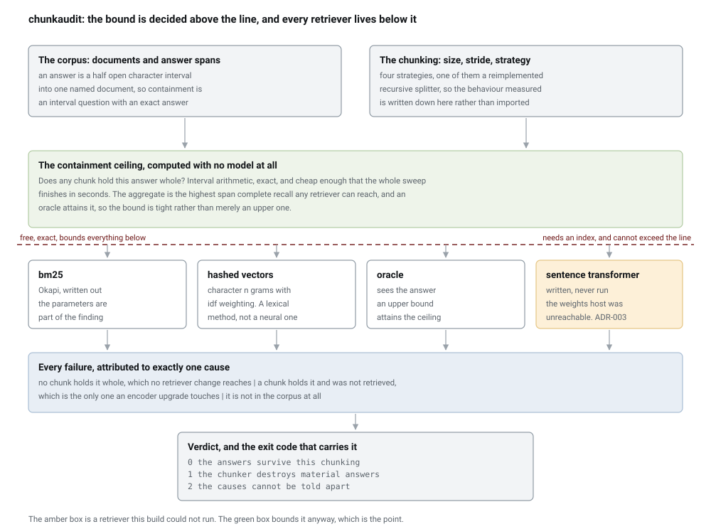
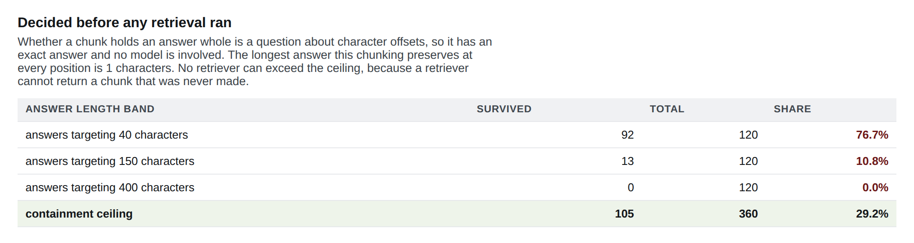
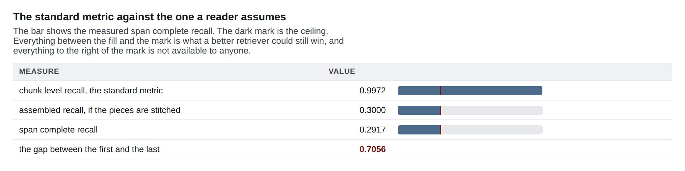
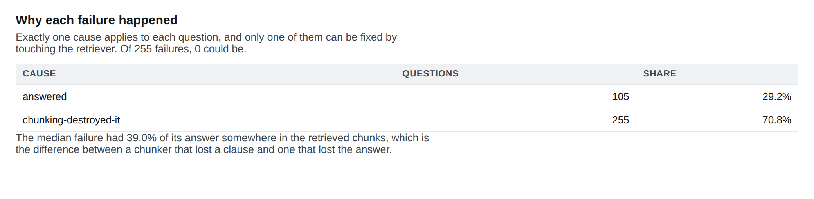
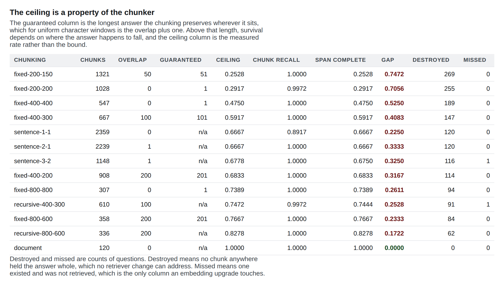

# chunk-recall-audit

**A retrieval metric is computed on the chunks the chunker produced, so it cannot see the answers the chunker destroyed. This reports the answers that no chunk holds whole, proves the bound is a property of the chunker rather than of any retriever, and names which failures a better embedding model could actually fix.**

[](https://github.com/srujan20/chunk-recall-audit/actions/workflows/ci.yml)
[](tests)
[](tools/collect_metrics.py)
[](pyproject.toml)
[](LICENSE)

## The question a retrieval metric structurally cannot answer

Recall at k asks whether any retrieved chunk touches the answer. A chunk holding
the first half of an answer counts, and so does a chunk holding the last three
words. So four questions are not merely hard for a retrieval dashboard, they are
outside what it is a function of:

1. Did any single retrieved chunk hold enough to answer, or only pieces?
2. Of the failures, which ones would a better retriever have fixed, and which ones
   were already impossible before retrieval began?
3. What is the highest score any retriever could ever reach on this chunking?
4. What did the last change to chunk size and overlap actually buy?

## The numbers, including the ones that are not flattering

Whether a chunk holds an answer whole is a question about character offsets. It
has an exact answer, no model is involved, and aggregated over a labelled corpus
it gives a **containment ceiling**: the highest span complete recall any retriever
can reach on that chunking. It bounds BM25, it bounds a dense encoder, and it
bounds a perfect oracle, because none of them can return a chunk that was never
made.

**On 200 character chunks the ceiling is 0.2917**, leaving a gap of 0.7056 against the standard metric. The standard
metric on the same rankings reports a recall of 1.0 while span complete recall is
0.475 at four hundred characters and 0.7389 at eight hundred. The worst is fixed-200-150, where the standard metric reports a
recall of 1.0, the pipeline actually answers 0.2528, and 269 of them cannot answer
on their own out of 360 questions. That is a gap of 0.7472.

The uncomfortable part is who can fix it. Across 13 chunkings with BM25 there were
1663 failures: **1661 were the chunker's and 2 were the retriever's.** 10 of the
thirteen configurations have no retriever fixable failure at all. An embedding
upgrade on those buys nothing, and no retrieval metric in use today would say so.

And the gap does not close by retrieving more. On the worst chunking it is 0.85 at
k equal to one and still 0.7472 at twenty, because span complete recall goes flat
from k equal to 3 while the standard metric climbs to one. Retrieving more copies
of a broken answer does not assemble one.

Every figure below is produced by code in this repository, re-measured by CI on
every push, and guarded against the prose by phrase matching rather than digit
matching. 232 tests, 99.2 percent line coverage, over 260 audited combinations.

## Quickstart

Prerequisites: Python 3.11, 3.12 or 3.13. No API keys, no model weights, no
network at runtime.

```bash
git clone https://github.com/srujan20/chunk-recall-audit.git
cd chunk-recall-audit
pip install -e ".[dev]"

# The headline: a common chunk size, and what it destroyed. Exit code 1.
python -m chunkaudit audit --size 200 --stride 200

# Every chunking in the plan, sorted worst ceiling first.
python -m chunkaudit sweep --html report.html

# Re-measure every published number and check it against the documents.
make verify
```

The whole sweep of 13 chunkings by four retrievers by five values of k runs in
under 10 seconds. That is worth noticing rather than glossing: the expensive part
of a retrieval evaluation is normally the encoder, and the ceiling needs none. A
team can compute the number that bounds every retriever it will ever try before it
picks one.

## Claim 1: the two metrics are far apart, and only one of them means what you think

| Chunking | Chunks | Ceiling | Gap |
| --- | --- | --- | --- |
| fixed-200-150 | 1321 | 0.2528 | 0.7472 |
| fixed-200-200 | 1028 | 0.2917 | 0.7056 |
| fixed-400-400 | 547 | 0.475 | 0.525 |
| fixed-400-300 | 667 | 0.5917 | 0.4083 |
| sentence-1-1 | 2359 | 0.6667 | 0.225 |
| sentence-2-1 | 2239 | 0.6667 | 0.3333 |
| sentence-3-2 | 1148 | 0.6778 | 0.325 |
| fixed-400-200 | 908 | 0.6833 | 0.3167 |
| fixed-800-800 | 307 | 0.7389 | 0.2611 |
| recursive-400-300 | 610 | 0.7472 | 0.2528 |
| fixed-800-600 | 358 | 0.7667 | 0.2333 |
| recursive-800-600 | 336 | 0.8278 | 0.1722 |
| document | 120 | 1.0 | 0.0 |

Measured with BM25 at k equal to 5 over 360 questions in 120 generated documents.
The ceiling column involved no retrieval at all.

Reproduce with `python experiments/exp01_the_gap_the_standard_metric_hides.py`.

## Claim 2: almost nobody's retrieval problem is a retrieval problem

Three causes, mutually exclusive, and the standard metric cannot tell the first
two apart because both look identical to a function of the chunks:

| Cause | Fixable by a better retriever |
| --- | --- |
| No chunk anywhere holds the answer whole | no |
| A chunk holds it whole and was not retrieved | yes |
| The answer is not in the corpus | no |

Across the 13 chunkings at k equal to 5, BM25 produced 1663 failures. 1661 were
the chunker's and 2 were the retriever's. The hashed vector retriever, which is
weaker, produced 177 retrieval failures against the same 1661 from chunking, so
even a materially worse retriever does not change which cause dominates.

Reproduce with `python experiments/exp02_who_can_fix_this.py`.

## Claim 3: your overlap is a guarantee threshold on answer length

For uniform character windows of size S advanced by stride T, an answer of length
L sits inside some window wherever it falls if and only if L is at most S minus T
plus one, which is the overlap plus one. That is arithmetic, not a measurement,
and this repository checks it by exhaustion rather than asserting it: at size four
hundred and stride three hundred the guarantee is 101 characters at size four
hundred, and every one of all 3899 positions survives at that length. One
character longer already fails somewhere.

Above the threshold, survival is a lottery whose odds are computable:

| Answer length | 400-400 survival |
| --- | --- |
| 10 | 0.98 |
| 25 | 0.946 |
| 50 | 0.888 |
| 101 | 0.769 |
| 102 | 0.767 |
| 150 | 0.652 |
| 201 | 0.526 |
| 250 | 0.402 |

At 150 characters a chunking with no overlap keeps 0.652 of positions, falling
down to 0.557 for a four hundred character answer even at eight hundred character
windows. Nobody sizing a chunker is told this, and it takes no model to compute.

Reproduce with `python experiments/exp03_the_guarantee_threshold.py`.

## Claim 4: adding overlap can make it worse

Window starts are multiples of the stride, so a smaller stride is not a superset
of a larger one. With a stride of 800 the starts are 0 and 800; with 600 they are
0, 600 and 1200. An answer needing a window that begins between 710 and 810 is
kept by the first and destroyed by the second. Above the guarantee threshold,
overlap moves the lottery rather than winning it.

There is 1 case in this plan where it happened: going from fixed-200-200 to
fixed-200-150, the ceiling falls by 0.0389 while the index grows by 293 more
chunks. Overlap bought nothing and cost storage. There is also an exact
counterexample in the test suite, constructed rather than found, so the claim does
not depend on this corpus.

| | costs | buys |
| --- | --- | --- |
| More overlap | chunks stored, linearly | a higher guarantee threshold, exactly |
| More overlap above that threshold | the same storage | a different set of surviving positions, not more of them |

## Claim 5: the whole document chunker wins on this metric, and that is not the recommendation

A single chunk per document has a perfect ceiling and the smallest index in the
plan. The reason nobody ships it is a price the ceiling cannot show, so this
repository measures it: it hands 7662 characters per question to whatever consumes
the results. The best real alternative reaches 0.8278 on 3731 characters, less
than half.

What those extra characters cost downstream, in generation quality, latency and
token spend, is outside this repository. Saying so is more useful than leaving a
table in which one row dominates every other for reasons the table cannot show.

Reproduce with `python experiments/exp04_what_overlap_costs_and_buys.py`.

## Claim 6: the chunker is the bigger lever, and the ceiling is tight

Holding the corpus and the questions fixed, changing between the two real
retrievers moves span complete recall by at most 0.1972. Changing the chunker
moves it by up to 0.7917, which is 4 times as far.

The retriever is not irrelevant: the gap between BM25 and a seeded shuffle reaches
0.9722, so the retriever matters. It is the smaller lever.

The ceiling is also tight rather than merely an upper bound. An oracle that ranks
by overlap with the answer attains it on every chunking in the plan, with a worst
absolute difference of 0.0. If the oracle came in below, the claim that no
retriever reaches past the ceiling would be weaker than stated.

Reproduce with `python experiments/exp05_which_lever_matters.py`.

## Claim 7: a measured zero is not zero

The corpus has 360 questions, so any rate measured here has a resolution floor of
one in 360. A measured zero supports "below 0.28 percent" and nothing stronger. To
support a claim of one in a thousand this corpus would need to be about three times
larger, and the experiment prints that arithmetic rather than leaving a zero to be
read as an absence.

## The bugs the measurement found

**A recall above a bound that cannot be exceeded.** The first version compared
answer spans to chunk spans without checking they came from the same document.
Offsets are per document, so a chunk covering characters 0 to 800 of one document
numerically contains an answer at characters 100 to 500 of another. It reported a
span complete recall of 0.850 against a ceiling of 0.828, which is impossible: the
ceiling is an upper bound by construction, so a measured value above it was proof
the measurement was wrong rather than news about chunking. The invariant is now a
test, and it is the most valuable test here because it can only fail when a
measurement is impossible.

**A corpus that was unanswerable rather than hard.** Eight topics and eight
subjects repeat every sixty four documents, so a question naming only those two
matched fifteen documents equally well. Every retriever scored near chance and the
failure attribution reported a retrieval problem that was really a labelling
problem. Each document now carries a token unique to it.

**A comparison that restated how the corpus was built.** The first generator made
every answer a single sentence, which handed every sentence window strategy a
containment ceiling of exactly one. That was not a finding. Long answers now span
several sentences, which is also what a real answer to a procedural question looks
like.

**A determinism test that was right for the wrong reason.** Two rates are
undefined rather than zero when nothing failed, and both came out as a nan, which
compares unequal to itself. The test failed on two sweeps that were identical in
every other column. A row that cannot be compared to itself is a row no downstream
check can trust, so the row type now serialises a non finite float as null.

## Architecture



The dividing line is the chunking. Everything above it is decided by offsets and
costs nothing to compute. Everything below it is a retrieval question, and it is
bounded by the line above.

## Evidence



One audit of a 200 character chunking, screenshotted from the HTML report the tool
produces. The framing is driven by named headings rather than pixel offsets, and
the capture script fails the run if the verdict badge is invisible or falls below
a contrast ratio of 4.5, because a screenshot tool is the only thing in the
pipeline that can see pixels.



The dark mark on each bar is the ceiling. The distance from the fill to the mark
is what a better retriever could still win; everything to the right of the mark is
not available to anyone. Notice that the standard metric's bar runs well past the
mark, which is the whole finding in one picture.



The attribution the standard metric cannot make. Two of these three causes look
identical to any function of the retrieved chunks.



The sweep, sorted by ceiling. The guaranteed column is the longest answer each
configuration preserves wherever it falls, which for uniform windows is the
overlap plus one.
[docs/screenshots/manifest.json](docs/screenshots/manifest.json) records which
report each image came from and the measured contrast of the badge in it.


A replay, not a screen recording. Every line of terminal text is captured stdout
from a command that actually ran, and each segment is paced by that command's
measured wall time. [docs/video/manifest.json](docs/video/manifest.json) lists
every command with its exit code and duration, and the MP4 is at
[docs/video/demo.mp4](docs/video/demo.mp4).

## The corpus, and specifically the awkward cases

120 generated documents, 360 questions, three answer length bands. The bands are
targets rather than exact lengths, and the experiments publish the distribution
that came out.

| What is in it | Why |
| --- | --- |
| A token unique to each document, in the question and the answer | without it the questions matched fifteen documents each and every retriever scored near chance |
| A distractor sentence carrying the question's key terms and none of its answer | without it a lexical retriever scores too well for the corpus to distinguish a retrieval failure from a chunking one |
| Answers that span two or three sentences | so a sentence window strategy is not handed a perfect ceiling by construction |
| Answers that straddle the guarantee threshold | so the survival curve has something to measure either side of it |

Four retrievers run: Okapi BM25 written out here, a hashed character n gram cosine
with inverse document frequency weighting, an oracle that sees the answer, and a
seeded shuffle as the floor. The hashed one is a lexical vectoriser and nothing in
this repository calls it a neural encoder.

## What this repository cannot establish

Its own section, because it is the part a senior reviewer reads first.

**A dense transformer encoder was never run.** The model weights host is not
reachable from the environment this was built in, so the sentence transformer path
is written, fenced behind an optional extra, and has never produced a number. What
that does not threaten is the headline: the containment ceiling bounds every
retriever, so it bounds that one too, and the oracle result shows the bound is
attained. What it does mean is that the *retriever range* in claim 6 covers two
lexical methods and not a dense one, and a dense encoder could plausibly widen it.
ADR-003 states exactly that.

**The corpus is generated.** The rates here are properties of it. What transfers
is the ceiling arithmetic, which is a property of the chunker and holds on any
corpus, and the guarantee threshold, which is a closed form.

**The recursive splitter is a reimplementation.** It reproduces documented
behaviour and is not a port of anybody's code, so its numbers describe this
implementation. That is deliberate: a chunker whose behaviour is a dependency's
implementation detail would make every figure a statement about a version number.

**Answer quality is not measured.** Containment is about retrievability. Whether a
model given a complete answer produces a good one is a different question needing
a judge, and that is the Pivot.

**The downstream cost of long chunks is not measured.** Claim 5 prices the
characters retrieved and stops there. Generation quality, latency and token spend
are real costs this repository does not touch.

## Layout, exit codes and reproduction

```
src/chunkaudit/
  documents.py   the corpus, with answers as character offsets
  chunking.py    four strategies, including a reimplemented recursive splitter
  ceiling.py     the bound. No model, no similarity, no ranking
  retrieval.py   bm25, hashed vectors, an oracle, a shuffle, and one written but unrun
  metrics.py     two recalls, three causes, one of them fixable
  audit.py       three verdicts and the exit codes they carry
  pipeline.py    the sweep, and the row type every experiment reduces
  report.py      text and HTML reports, with the ceiling marked on every bar
  cli.py         the commands and the exit codes
configs/policy.yaml every threshold, with a comment on who picks it
experiments/       five experiments writing JSON to docs/experiments/
tools/             receipts, diagram, screenshots, demo recorder, PDF
docs/adr/          five decisions with their rejected alternatives
```

| Exit code | Meaning |
| --- | --- |
| 0 | the audit ran and the answers survive this chunking |
| 1 | the audit ran and the chunker destroys material answers |
| 2 | the audit ran and the causes cannot be told apart, so a human is needed |
| 3 | the audit could not run: a corpus with no questions, an answer span outside its document, or a chunking that produced nothing for a document with text |
| 4 | the invocation was wrong: an unknown strategy or retriever, a stride larger than its size, a bad policy, or an optional retriever that is not installed |

The distinction between 0 and 3 is deliberate. A tool that returns the same code
for "the answers survived" and "I could not check" is a tool whose zero means
nothing.

```bash
make lint        # ruff check and format check
make test        # pytest with coverage
make experiments # re-run all five, writing docs/experiments/*.json
make receipts    # re-measure every figure, then check it against the documents
make verify      # lint, test, receipts
make evidence    # diagram, screenshots, demo and the README image check
make pdf         # lay out the defense guide for offline reading
```

`tools/check_numbers.py` matches anchor phrases rather than digits, because a
digit search passes while the sentence around the digits has gone stale. It
collapses whitespace first, so an anchor does not have to be lucky about where a
markdown line broke, and `tools/collect_metrics.py` refuses an anchor with no
placeholder in it, because such an anchor matches whatever the document says. The
checker also reports numbers in the prose that no metric explains, and CI runs it
with `--strict`, which makes that reverse direction load bearing: the forward
check catches a deleted figure and the reverse check catches an altered one.

The tables in claims 1 and 3 are guarded cell by cell, which is a weaker claim
than the prose anchors: a cell is checked for its value appearing as a table cell,
not for appearing in its own row. Guarding the row label too would mean generating
the README rather than writing it.

## Tech stack

| Technology | Role here | Why this one |
| --- | --- | --- |
| numpy | score matrices, ranking, the hashed vectoriser | the whole sweep is matrix products, which is why it finishes in under 10 seconds |
| PyYAML | the policy file | thresholds are the subject of this repository, so they cannot live in code |
| sentence-transformers, optional | a dense retriever, written and never run | the honest disclosure is in ADR-003 and in the tool's own output |
| pytest, coverage | 232 tests, measured | the ceiling invariant is a test, and it can only fail when a measurement is impossible |
| ruff | lint and format | one tool, one config, no argument about style in review |
| GitHub Actions | three Pythons, then a pinned receipts job | the published numbers are re-measured on every push |
| Playwright, ffmpeg | screenshots and the replay video | the only way to check a badge is legible is to look at pixels |

No embedding library, no vector database and no LLM. Every number here is
reproducible offline with one command, and ADR-003 explains what that costs.

## Decisions

- [ADR-001: The ceiling is decided before retrieval](docs/adr/ADR-001-the-ceiling-is-decided-before-retrieval.md)
- [ADR-002: Offsets rather than text](docs/adr/ADR-002-offsets-rather-than-text.md)
- [ADR-003: The encoder this build could not reach](docs/adr/ADR-003-the-encoder-this-build-could-not-reach.md)
- [ADR-004: Reimplement the splitter rather than import it](docs/adr/ADR-004-reimplement-the-splitter-rather-than-import-it.md)
- [ADR-005: Every rate carries its denominator](docs/adr/ADR-005-every-rate-carries-its-denominator.md)

## The Pivot, and future work

**Deliberately out of scope: generation.** No reranking, no answer synthesis, no
judge. The trigger condition for adding it is a claim about answer quality rather
than about retrievability, at which point the arithmetic here stops applying and
the repository would need a grader with its own error rate.

Where a second version would go, in order:

- Read a real corpus with real labelled answer spans, since every claim about
  magnitudes currently rests on a generated one. First metric to watch: the share
  of answers in a real question answering set that exceed the pipeline's guarantee
  threshold, because that single number decides whether any of this matters to
  them.
- Recommend a chunk size and overlap from a measured answer length distribution,
  since the guarantee threshold makes that a solved arithmetic problem and it
  currently arrives as a table rather than as advice.
- Price the downstream cost of longer chunks, which is the one column claim 5 is
  missing and the reason its winning row is not the recommendation.
- Extend the ceiling to semantic and layout aware chunkers, where the windows are
  not uniform and the guarantee is not a single number.
